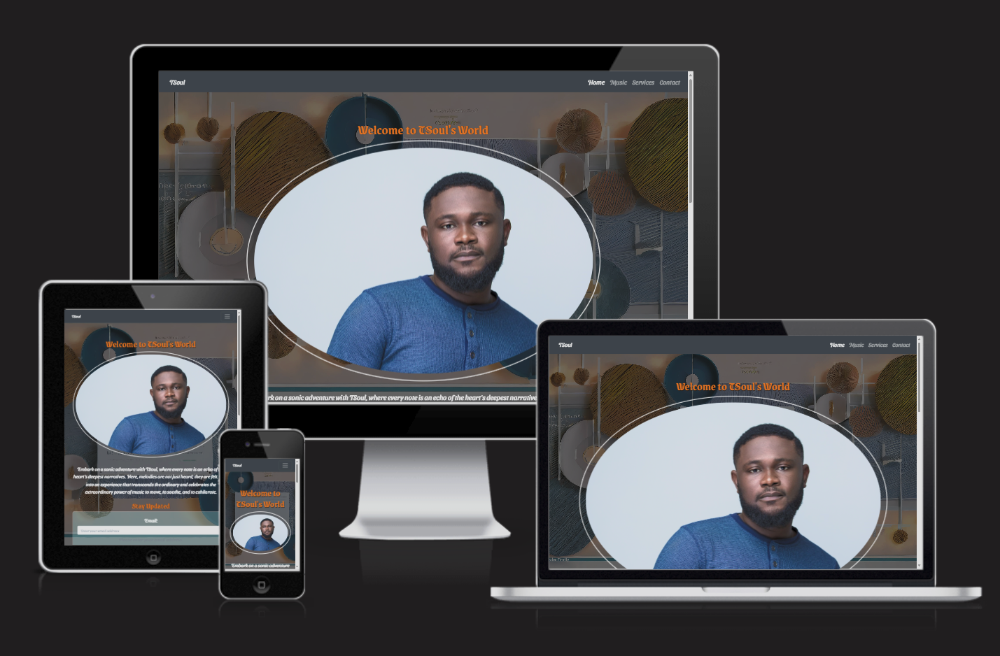

# TSoul - User Centric Milestone Project

## Introduction

Welcome to the "TSoul", my User-Centric Milestone Project. This project represents a pivotal point in my journey through the Full Stack Development course where I put my digital flare into motion. It is also a unique blend of soulful music and data analytics expertise embodied in a web platform. This website serves as a central hub for TSoul, the multifaceted persona of Temitope Akingbala, where the harmonious blend of melodic artistry and analytical prowess comes to life. I am often referred to as a "Jack of all trades". I have visualised a confluence of an artist's music site and a professional consulting site to account for my dual career paths, so its more like a multiple portfolio site. 

The live version of the project can be experienced here: [TSoul Website](https://topesoul.github.io/tsoul/index.html).

## Project Structure

- `index.html`: The landing page that welcomes visitors.
- `music.html`: Dedicated to TSoul's music portfolio.
- `services.html`: Details Temitope's professional services in workforce analytics.
- `contact.html`: A form to facilitate communication with TSoul.

## Table of Contents

- [Introduction](#introduction)
- [Project Structure](#project-structure)
- [User Experience (UX)](#user-experience-ux)
  - [Strategy](#strategy)
  - [Scope](#scope)
  - [Structure](#structure)
  - [Skeleton](#skeleton)
  - [Surface](#surface)
- [Features](#features)
- [Technologies Used](#technologies-used)
- [Testing](#testing)
- [Deployment](#deployment)
- [Credits](#credits)

---

## UX – User Experience Design

The website's primary aim is to introduce TSoul as an artist and analyst, creating a platform for a wide variety of individuals, including music enthusiasts and corporate or data-centric professionals. It aligns with my personal goal to merge these distinct yet harmonious paths. 
Informed by "The Elements of User-Experience" by Jesse James Garrett, the TSoul project prioritizes an engaging and intuitive user experience, structured into five distinct planes:

- The Strategy Plane
- The Scope Plane
- The Structure Plane
- The Skeleton Plane
- The Surface Plane

---

### Strategy

The site aims to showcase the talents and services of TSoul, a musician and data analyst, and to connect with his audience and potential clients.
My strategy here is based on a meticulously planned approach underscored by the creation of a platform that showcases TSoul's talents and services while optimizing the user journey with thoughtful interaction design.

As a developer, I am interested in understanding the users of this site and forms the main focus of my approach on this project. I have identified the following goals for visitors:

#### First-Time Visitor Goals
1. Understand TSoul's dual career as an artist and data analyst.
2. Navigate the website intuitively to find music or professional services.

#### Returning Visitor Goals
1. Explore new music releases or services updates.
2. Easily engage with TSoul for collaboration or service inquiries.

---

### Scope

The product includes features such as responsive navigation bar, music streaming services, a professional portfolio, a contact form, and social media links. The content consists of text, images, and videos that highlight TSoul’s work and personality.

Key features of the project include:
- A rich discography section with integrated media players for TSoul's music.
- A professional services section detailing TSoul's expertise in data and workforce analytics.
- An intuitive and responsive design to ensure a seamless experience on all devices.

---

### Structure

I thought extensively about what text content to use while still keeping a minimalistic design, for this I employed some inspiration from my blogs and media publications to synthesize an artistic narrative, feel and overall experience.

The website's structure is designed to guide users effortlessly from one section to the next, providing a comprehensive overview of TSoul's offerings. Clear, logical navigation ensures that users can find the information they are looking for with ease. TSoul project is organized into sections that correspond to the main features, such as home, music, services, and contact. The user can choose to navigate between the sections using the navigation bar or the footer. The user can also interact with the site by streaming music, watching videos, filling out the contact form, or following the social media links.

---

### Skeleton

Employing a minimalist design philosophy, the skeleton of the site is clean and user-focused. Attention is centered on content and interactions, with a layout that is both aesthetically pleasing and highly functional.

The site uses a grid-based layout that adapts to different screen sizes and devices. The navigation bar is fixed at the top and collapses into a hamburger menu on smaller screens. The footer contains the social media links and the logo. The product uses visual cues such as icons, buttons, and headings to guide the user.

Below is a link to the initial draft of the wireframes I created for the project and 
an initial conceptual idea of how everything would be structured and how everything would respond on different devices.

[TSoul-Project Wireframes](documentation/tsoulprojectwireframe.pdf)

I also typed up all my pages beforehand to help me to proofread the content and fix the grammatical error. 
It also allowed me to plan my text, structure my paragraphs, and condense text under subheadings.

---

### Surface

TSoul project uses a dark and cool colour scheme that contrasts with the bright and warm colours of the hero images and the chocolate colour of the headings. The site uses three fonts: Sansita Swashed for the body text, Grenze Gotisch for the headings, and Bellota Text for the services section. The site also uses animations, transitions, and hover effects to create a dynamic and engaging user experience. 

The surface design utilizes general themes and typography that reflect TSoul's personal brand. I have also utilised fallback fonts to ensure wider support across various scenarios. I have also maintained a consistent theme across all pages to ensure that visual elements can engage users and promote readability and ease of navigation especially when considering the transparent and static background cover image overlay used.

---

## Features

This project integrates a responsive design with a focus on providing a seamless experience for both desktop and mobile users. The strategic design and functionality of the site is to both first-time and returning visitors with a clear and logical navigation experience.
The project also boasts of a blend of artistic display and professional showcase:

- **Responsive Design:** Adaptive to any device, providing an optimal browsing experience.
- **Responsive Navigation Bar:** Tailored for a frictionless navigation experience across a variety of devices.
- **Dynamic Footer:** A strong social media foothold is established, inviting users to connect with TSoul across various platforms directly from the website.
- **Engaging Music Platform & Streaming:** The paltform allows for instant access to TSoul's latest tracks. Visitors can immerse themselves in TSoul's discography, with songs available for streaming through a stylish and user-friendly media player interface.
- **Professional Services:** Detailed overview of TSoul's data analytics and consultancy services through a structured professional portfolio layout.
- **Contact & Engagement:** Streamlined and user-friendly, the contact section is designed not just to gather inquiries but to foster a connection  between TSoul and his audience, be it for musical collaborations or professional consultancy.
- **Captivating Hero Images:** Visual anchors reflecting the essence of TSoul's spirit and professional demeanor.

### Enhanced Accessibility

- Forms include `required` attributes and ARIA labels for improved accessibility, catering to users with disabilities.

### Improved Readability

- Content is structured for enhanced readability, with long paragraphs broken into shorter lines for better maintainability.

### Responsive Design

- The website is designed to be visually appealing and fully functional across both desktop and mobile devices.

### Client-side Validation

- Custom JavaScript is used for client-side form validation, providing immediate feedback to users on their input.

### Optimized Layout

- Layout adjustments and code optimizations contribute to a clean and efficient website structure.

## Development Process

The development process of the TSoul website prioritized semantic HTML structure, custom CSS styling for visual design, and JavaScript integration for dynamic functionality and user interaction, such as:

- **Parallax Effect**: Enhancing visual depth and user engagement.
- **Spotify Embed**: Allowing users to stream TSoul's music directly on the site.
- **Featured Video**: Showcasing TSoul's performances.

---

## Future Work

- Potential integration of a Content Management System (CMS) for easier content updates.
- Expansion of the music section to include a comprehensive discography.
- Addition of a blog for updates and news directly from TSoul.
- Continuous cross-browser and device compatibility testing.
- Regular content updates to maintain engagement and relevance.
- Exploration of e-commerce features for merchandise sales.

---

## **Technologies Used** ##

- [HTML](https://developer.mozilla.org/en-US/docs/Web/HTML)
    - Used as the basic building block for the project and to structure the content.

- [CSS](https://developer.mozilla.org/en-US/docs/Learn/Getting_started_with_the_web/CSS_basics)
    - Used to style all the web content across the project. 

- [Bootstrap](https://getbootstrap.com/)
    - Used as the main framework to make the project responsive.

- [jQuery](https://jquery.com/)
    - Used with Bootstrap to make the navbar responsive.

- [JavaScript](https://www.javascript.com/)
    - Used for the bootstrap navbar for extending collapse plugin to implement responsive behavior
    - Used for parallax and scroll effect in the music page
    - Used for handling form validations and submission behaviour

- [Hover.css](https://ianlunn.github.io/Hover/)
    - Used on the social meadia icons in the footer when hovered over.

- [Google Fonts](https://fonts.google.com/)
    - Used to obtain the fonts linked in the header, fonts used were Roboto and Dancing Script

- [Font Awesome](https://fontawesome.com/)
    - Used to obtain the social media icons used in the footer.

- [Google Developer Tools](https://developers.google.com/web/tools/chrome-devtools)
    - Used as a primary method of fixing spacing issues, finding bugs, and testing responsiveness across the project.

- [Github](https://github.com/)
    - Used to store code for the project after being pushed.

- [Git](https://git-scm.com/)
    - Used for version control by utilizing the Gitpod terminal to commit to Git and Push to GitHub.

- [Gitpod](https://www.gitpod.io/)
    - Used as the development enviroment.

- GoodNotes App on Samsung S9 Ultra Tablet
    - Used to create the wireframes for the project.

- [AutoPrefixer](https://autoprefixer.github.io/)
    - Used to parse my CSS vendor prefixes.

- [Grammarly](https://www.grammarly.com/)
    - Used to fix the thousands of grammar errors across the project.
 
---

## **Testing** ##

Comprehensive testing was conducted to ensure each feature performs as expected across different browsers and devices. Here is a summary of our testing procedure:

| Feature              | Expected Outcome                                  | Testing Performed      | Pass/Fail |
|----------------------|---------------------------------------------------|------------------------|-----------|
| Responsive Design    | Display correctly on mobile and desktop           | Resize browser         | Pass      |
| Music Streaming      | Smooth playback through Spotify and YouTube       | Function test on embed | Pass      |
| Social Media Links   | Direct to respective social platforms             | Click each link        | Pass      |
| Professional Services| Clearly present TSoul's consulting capabilities   | Content review         | Pass      |
| Contact Form         | Submit inquiries and bookings                     | Form submission test   | Pass      |
| Cross-Browser Testing| Functionality on Chrome, Safari, and Edge         | Open site on browsers  | Pass      |
| Map widget | Clear display of upcoming shows and functional map | Loads and displays on multiple devices | Pass |
| Service Details | Informative and clear presentation | Content review and user feedback | Pass |
| Contact Form | Reliable and user-friendly form submission and feedback | Submission tests and confirmation checks | Pass |

**Further Testing**

- Google Chrome Developer tools were used throughout the project to help me to test the responsiveness across devices.
- Google Chrome Developer tools used to emulate devices,
    - Apple iPad
    - Apple iPad Pro
    - Microsoft Surface Duo
    - Motorola G4
    - Samsung Galaxy S5
    - Google Pixel 2/2 XL
    - Apple iPhone 5/SE
    - Apple iPhone 6/7/8
    - Apple iPhone 6/7/8 Plus
    - Apple iPhone X

I used the W3C Markup Validator and W3C CSS Validator  to validate every page of the project to ensure
there were no syntax errors in the project.

---

### Known Bugs and Fixes

**Issue with iframe src attribute: Illegal character**
- **Description:** URL in the `src` attribute of the `iframe` contains illegal characters (`[`, `]`). Encoding recommended but may disrupt functionality for services like Reverbnation.
- **Status:** Unresolved due to potential impact on functionality.

**Incorrect iframe width value**
- **Fix:** Removed `width="100%"` attribute and adjusted width using CSS for proper responsiveness.

**Obsolete attributes on iframe**
- **Fix:** Replaced `frameborder` and `allowtransparency` attributes with CSS styling (`border: none;` and appropriate transparency settings) for modern compliance.

**Error: Stray start tag footer and stray div tag**
- **Status:** Unresolved. Comprehensive checks confirmed no structural errors related to `<footer>` or stray `
` tags; may be false positives.

**Potentially Bad Value for Attribute Sandbox on Element iframe (Reverbnation widget)**
- **Fix:** Removed `allow-same-origin` to enhance security.

**Page titles not updated in head element**
- **Fix:** Updated the head element for each file to accurately reflect the current page title in browser tabs.

**Social Links in footer not updated**
- **Fix:** Corrected placeholder text with actual social media links, ensuring they open in new tabs for user convenience.

**HTML content refactoring for readability, maintainability, and accessibility**
- **Action:** Performed HTML content refactoring to improve readability and maintainability. Enhanced accessibility by integrating ARIA labels and improving overall website accessibility.

**CSS updates for improved responsiveness and visual appeal**
- **Action:** Made CSS updates to enhance the responsiveness and visual appeal of the website, ensuring a seamless experience across various devices.

**Implementation of client-side form validation**
- **Action:** Implemented client-side validation to enhance the user experience by preventing the submission of invalid forms.

**Final layout refinements for optimized website structure**
- **Action:** Conducted final layout refinements to ensure an optimized website structure for better navigation and user engagement.

**Custom thank you page for form submission confirmation**
- **Action:** Created a custom thank you HTML page to provide users with confirmation upon submission of the mail signup form and the contact/inquiries form, addressing the issue of form submission bouncing back when using the post method.

---

## **Deployment** ##

**Github**

This project is deployed using GitHub pages using the following process,

**Deploying a GitHub Repository via GitHub Pages**

1. In your *Repository* section, select the *Repository* you wish to deploy.
2. In the top horizontal Menu, locate and click the *Settings* link.
3. Inside the *Setting* page, around halfway down locate the *GitHub Pages* Section.
4. Under *Source*, select the None tab and change it to *Main* and click *Save*.
5. Finally once the page resets scroll back down to the *GitHub Pages* Section to see the following message 
"Your site is ready to be published at *(Link to the GitHub Page Web Address)*".
It can take time for the link to open your project initially, so please don't be worried if it down not load immediately.

**Forking the Github Repository**

You can fork a GitHub Repository to make a copy of the original repository to view or make changes without it affecting the original repository.

1. Find the GitHub repository.
2. At the top of the page to the right, under your account, click the *Fork* button.
3. You will now have a copy of the repository in your GitHub account.

**Making a Local Clone**

1. Find the GitHub Repository.
2. *Click* the *Code* button
3. *Copy* the link shown.
4. In *Gitpod*, change the directory to the location you would like the cloned directory to be located.
5. *Type* `git clone`, and *paste* the link you copied in step 3.
6. Press *Enter*  to have the local clone created.
---

## **Credits** ##

**Code**

- [Stackoverflow](https://stackoverflow.com/)
    - Helping find to solution to the margin issue appearing on Chrome Dev tools.

- [Matt Rudge, Code Institute](https://codeinstitute.net/)
    - Navbar style.
    - Dark Overlay on the Home Page hero image.
    - Social Media icons layout in the footer.
    - Hover effect on the social media icons.
    - Form on the Contact Us page.

- [Drew Ryan](https://www.youtube.com/channel/UCtXGz0MBuqZUC8rmGddc07Q)
    - Idea for the text shadow was taken from his video, to help the jumbotron text stand out on the hero image on the Home Page.
    [Link to video](https://www.youtube.com/watch?v=V_lAhqLXT9A&t=835s&ab_channel=DrewRyan)

- [Bootstrap](https://getbootstrap.com/)
    - Bootstrap Library used throughout the project mainly to make site responsive using the Bootstrap Grid System.

**Content**
-  [Color Tool](https://material.io/resources/color/#!/?view.left=0&view.right=0&primary.color=9E9E9E&secondary.color=616161)
    - Used to help find and select colors used throughout the project.

- All content for this project is carefully curated to reflect TSoul's identity, balancing between the artistry of music and the technicality of data analysis.

- Branding and design elements uniquely TSoul, aligned with the thematic direction of the project.

Most content utilised are owned by me, however I have been inspired by available online pool of resources and research
came from the websites listed above. 
This project would not be possible without help from the websites.

**Media**    

- Images and media are sourced from personally owned resources and archives  

- [Adobe Firefly](https://firefly.adobe.com/generate/images)
    - Used only for background cover image.

**Acknowledgements**

Recognition is given to the Code Institute's learning platform and the Full Stack curriculum that has provided the framework and guidance for developing this project. Sincere thanks to my mentor for their expertise and support throughout the development process.
Also, special thanks are extended to the online developer communities, and supportive network of peers for their shared wisdom and encouragement throughout the journey and refinement of the TSoul project.